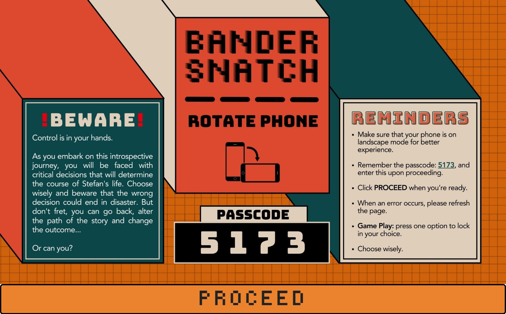
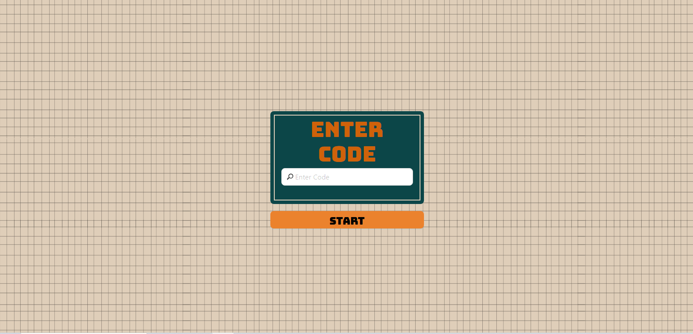
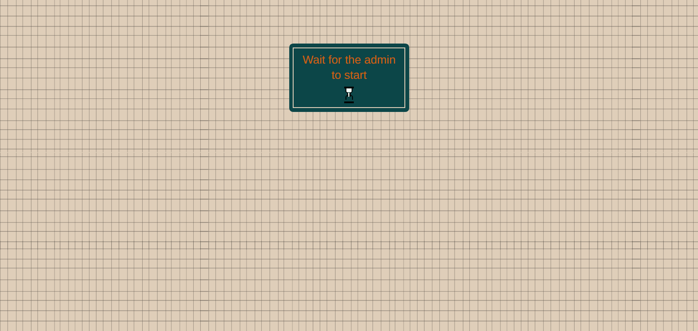
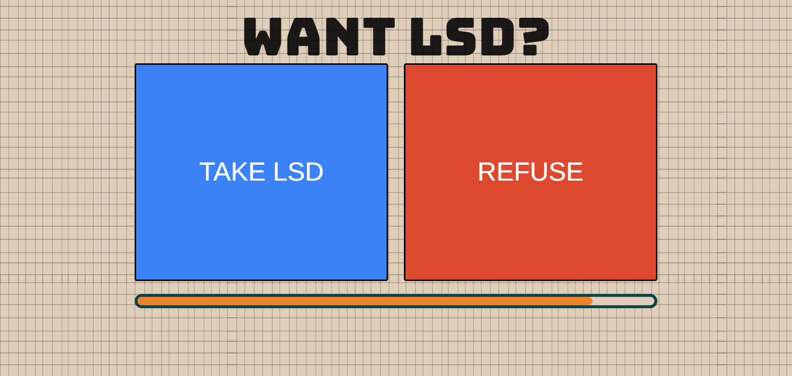
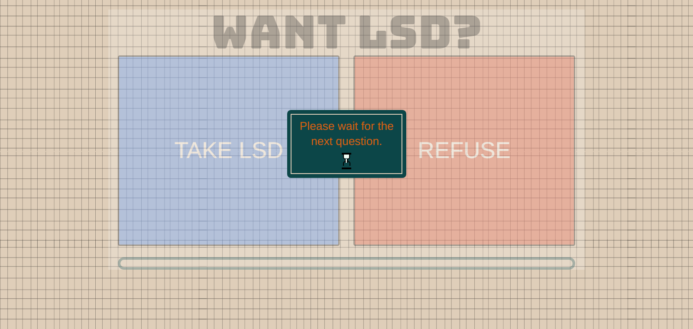
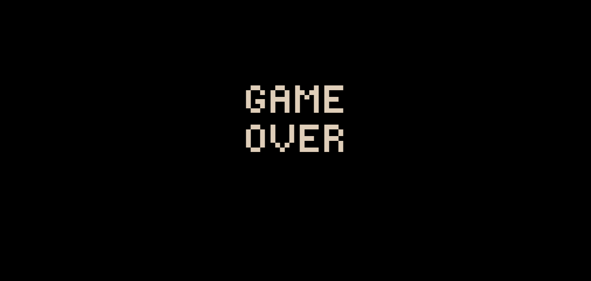
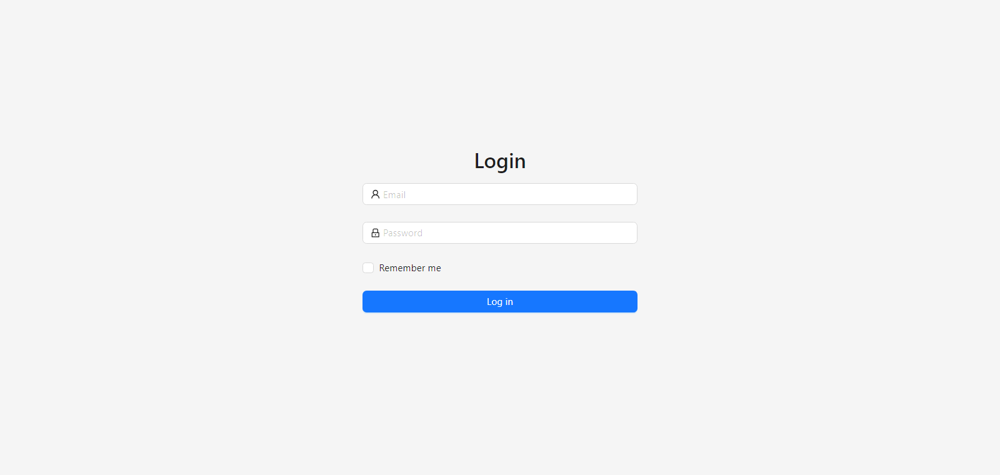
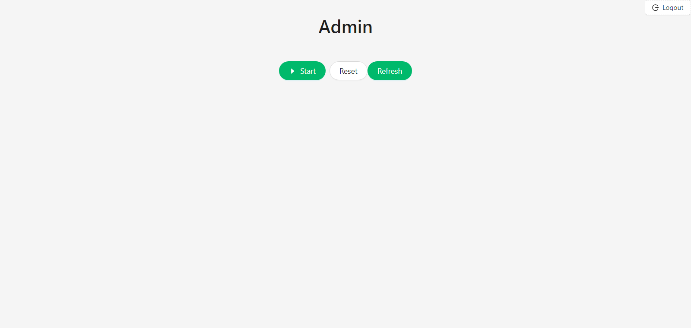
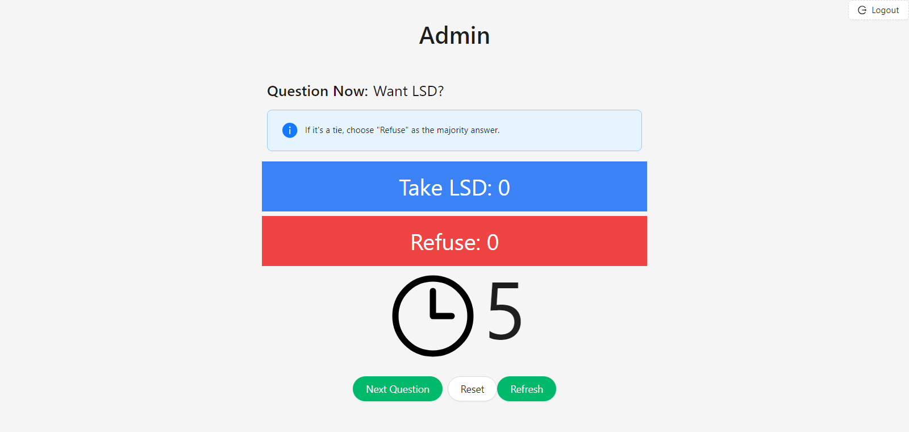
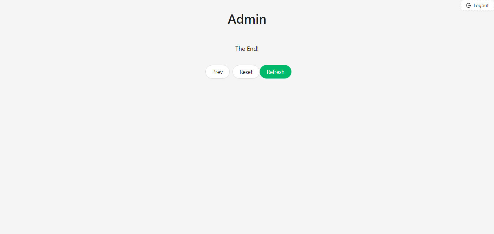

# Bandersnatch

## Introduction

Bandersnatch is a website created to facilitate interactive theater experiences by allowing the audience to choose the next scenario they would like to see. The project is currently in development and has not yet been completed. The project is based on the following technologies :

- [**Laravel**](https://laravel.com/)
- [**XState**](https://xstate.js.org/)
- [**React.JS**](https://react.dev/)
- [**Ant Design**](https://ant.design/)
- [**Tailwind CSS**](https://tailwindcss.com/)
- [**Inertia**](https://inertiajs.com/)
- [**Websockets via Ably**](https://ably.com/)

## Problem

Interactive questions and answers can be managed using tools like Google Forms or Kahoot. However, these technologies come with a drawback: they don't allow the facilitator to show the next question based on the most popular answer from the current question. This limitation led to the development of Bandersnatch, a solution aimed at providing interactive theater experiences for production design students at Benilde. Bandersnatch empowers the audience by letting them pick the next scenario they'd like to see. This effectively addresses the issue posed by existing technologies and significantly enriches the interactive nature of theater participation.
	
## Features

Update coming soon...

<!-- - **Login / Registration** - Users can log in by registering through our application. -->

## Sample

Below, you will find a snapshot of the project's current status. The showcased content provides an insight into the project's latest developments and progress.

  

	(landing page)

 

  

	(audience login)

 

  

	(audience waiting for the admin to start the questions)

 

  

	(sample question)

 

  

	(after answering)

 

  

	(end page after the questions)

 

<!-- Admin -->

  

	(admin login)

 

  

	(start)

 

  

  
	(start)

 

  

	(start)

 
