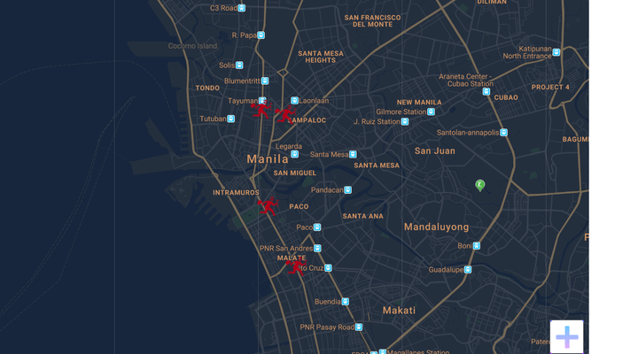

# Ligtas.PH

## Introduction

Ligtas.ph is a crowdsourced, map-based web application that enables users to report and view minor crimes. The proposed application aims to educate and inform Filipinos about the threats their communities face, while also providing the local government and police with improved statistical data to enhance public services for all Filipinos. The project is based on the following technologies :

- [**ASP.NET**](https://dotnet.microsoft.com/en-us/apps/aspnet/)
- [**Bootstrap**](https://getbootstrap.com/)
- [**jQuery**](https://jquery.com/)

## Features

- **Login / Registration** - Users can log in by registering through our application.
- **Crime Map Viewing via Google Maps API** - This feature allows every user to view specific areas where crimes typically occur on a map.
- **Report Crime** - Users have the capability to report crimes in specific areas. These reports contribute to the display of the crime map and related statistics.
- **Categorizations of Crime** - Crimes reported by users can be organized into categories like holdups, snatching, and others.
- **Crime Statistics** - The data collected from user reports offers valuable insights to the barangay, police, and emergency services. This enhanced data enables these entities to provide more effective and secure services to the community.
## Sample

  

