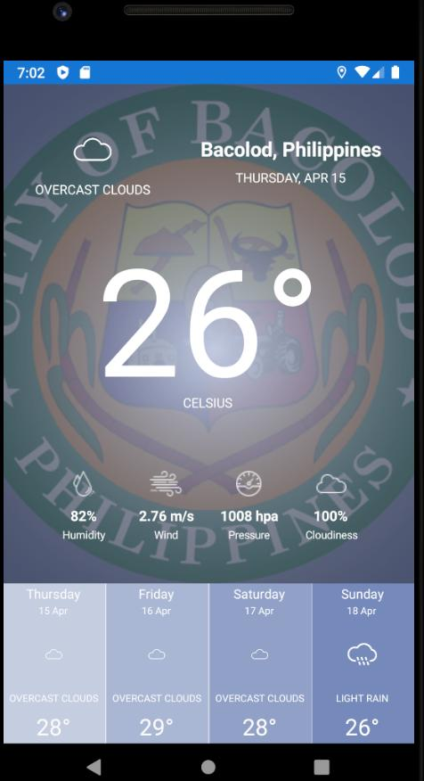

# Nimbus Weather Application

## Introduction

This project was developed collaboratively as part of our final academic assignment for the mobile development subject, using the Xamarin framework. Our application focuses on providing users with weather information based on their current location.

## Features

- **Date** - Displays the current date based on the location of the user.
- **Location** - Extracts the coordinates (longitude and latitude) from user's device to get their current location (in order to retrieve the name of their city and its corresponding weather)
- **Weather Condition** - Provides real-time weather conditions based on the location of the user.
- **Weather Information** -  Describes the weather in detail by providing the Humidity percentage, Wind rate, hPa or atmospheric pressure and Cloudiness percentage.
- **Week Extended Weather Forecast** - Displays the weather reading for the next 4 days.
- **Weather icon** - Display icon based on type of weather  (rainy,cloudy).
- **Trademark Display** - Sets the popular image from a location as a background (manila,valenzuela).

## Mockup

  

## GitHub repository

[View on GitHub](https://github.com/simonpangan/BenildeProjects/tree/master/MobDevtFinalProj)
